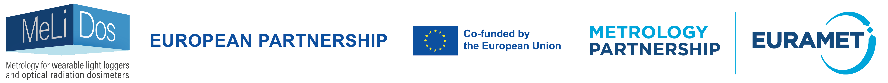
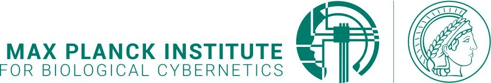
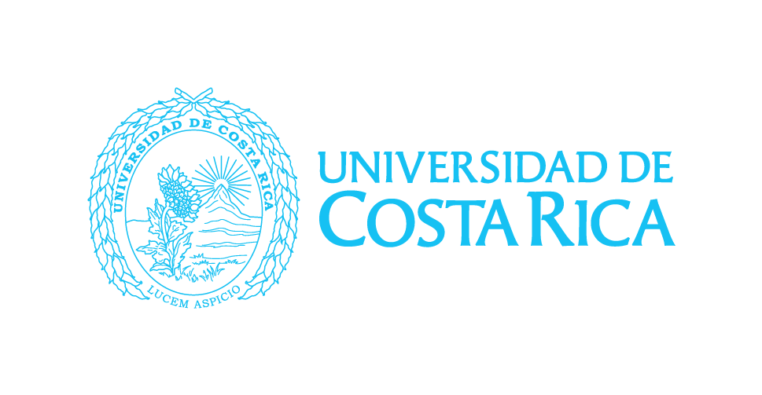
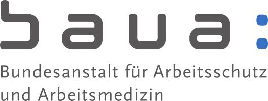
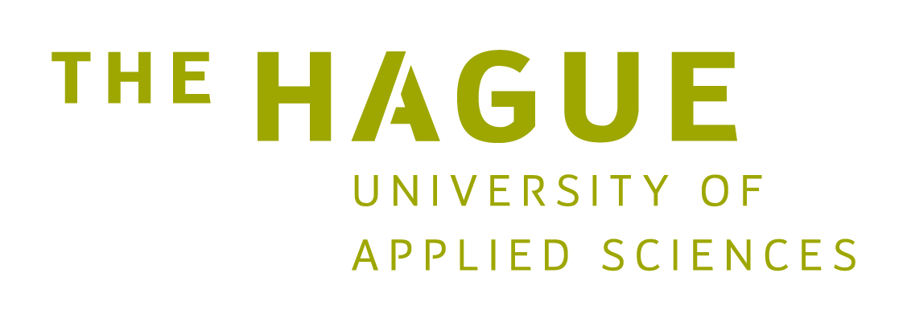
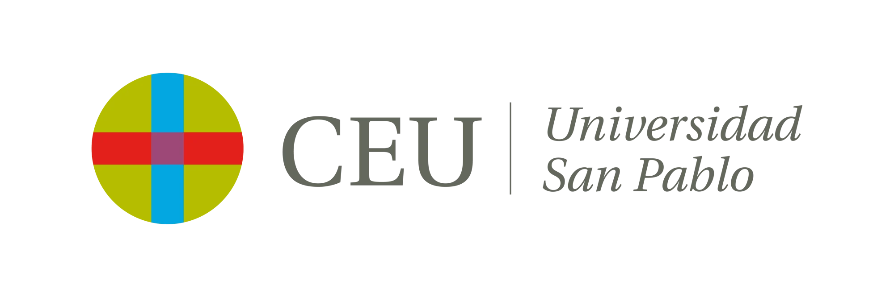
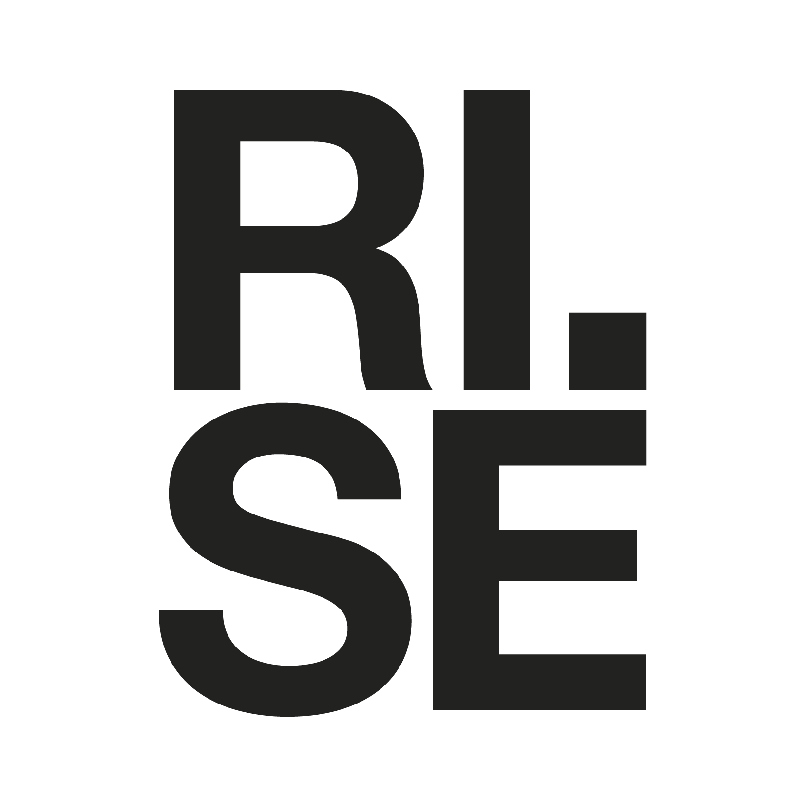

::: {.hero}
{.hero-banner fig-alt="MeLiDos banner"}

The day-night cycle has always cadenced life in nature, even long before the advent of human society. While fire was used to fight the dark of night, humans now systematically light up nights through electric lighting.

Indoor artificial light exposure (especially at night) differs from natural daylight patterns and may contribute to sleep disruption, stress, and broader health effects.
:::

## About the project

MeLiDos addresses non-visual and visual effects of light exposure and supports harmonized metrology for wearable light loggers and UV dosimeters.

In 2018, the International Commission on Illumination (CIE) released **CIE S 026:2018**, defining spectral sensitivity functions and quantities used to describe how optical radiation stimulates the five retinal photoreceptor classes associated with retina-mediated non-visual effects.

The study and application of this standard require robust measurement tools and consistent characterization workflows. Wearable light loggers vary in sensor form, position, technology, and output format. Without harmonized methods, validation and reproducibility are difficult.

MeLiDos proposes a practical framework developed by a European consortium with expertise in metrology, chronobiology, lighting, and sensing.

## Key thematic areas

1. **Harmonized characterization methods** for wearable light loggers and solar UV dosimeters with practical and cost-efficient procedures.
2. **Guidance for wearable logger use** from device selection to FAIR data collection, validation, analysis, and representation.
3. **Spatially resolved investigations** (e.g., image-based devices) to better approximate retinal-plane light exposure.

## Project timeline and outputs

The project runs over three years and ends in **May 2026**. Results are made available through this website, project materials, and associated repositories.

::: {.callout-note}
## Placeholder notice
Some homepage assets and historic media (e.g., original Squarespace-hosted background images and section visuals) were not included in the export bundle. Placeholder styling and structure are used where source media is missing.
:::

## Partners and collaborators

See the full collaborator page: [Collaborators](collaborators.qmd).

::: {.logo-grid}
{fig-alt="MPI logo"}
{fig-alt="UCR logo"}
{fig-alt="KNUST logo"}
{fig-alt="BAUA logo"}
{fig-alt="THUAS logo"}
{fig-alt="IZTECH logo"}
{fig-alt="FUSPCEU logo"}
{fig-alt="RISE logo"}
{fig-alt="TUM logo"}
:::

## Contact

See the full contact page: [Contact Us](contact.qmd).

For stakeholder participation, materials, and results access, please contact the MeLiDos consortium via the project GitHub organization:

- <https://github.com/MeLiDosProject>

