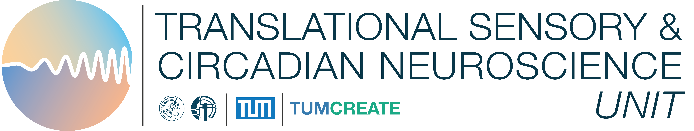
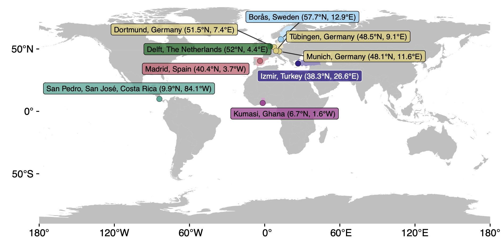
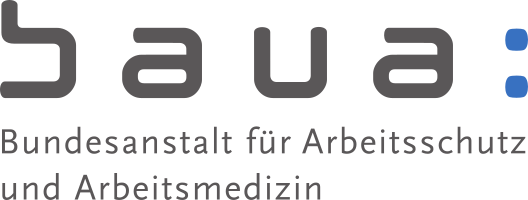
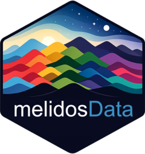

# MeLiDos field study

The [MeLiDos field study](https://github.com/MeLiDosProject) datasets contain wearable data for personal light exposure at the eye, chest, and wrist level for **191 participants across 9 sites and 7 countries, capturing 1480 participant days of annotated data**. Through a host of questionnaires at screening and discharge time, ecological momentary assessment, diaries, and logs, extensive auxiliary data are available.

| Institution (site Abbr.) | City | Country | Repository | DOI |
|----------|----------|-------------|--------------------------|---------------------|
| KNUST | Kumasi | Ghana | [AkuffoEtAl_Dataset_2025](https://github.com/MeLiDosProject/AkuffoEtAl_Dataset_2025) | 10.5281/zenodo.15576731 |
| UCR | San José | Costa Rica | [Sancho-SalasEtAl_Dataset_2025](https://github.com/MeLiDosProject/Sancho-SalasEtAl_Dataset_2025) | 10.5281/zenodo.17289456 |
| IZTECH | Izmir | Turkey | [DidikogluEtAl_Dataset_2025](https://github.com/MeLiDosProject/DidikogluEtAl_Dataset_2025) | 10.5281/zenodo.16568109 |
| FUSPCEU | Madrid | Spain | [BaezaEtAl_Dataset_2025](https://github.com/MeLiDosProject/BaezaEtAl_Dataset_2025) | 10.5281/zenodo.16834951 |
| TUM | Munich | Germany | [HildenEtAl_Dataset_2025](https://github.com/MeLiDosProject/HildenEtAl_Dataset_2025) | 10.5281/zenodo.16893901 |
| MPI | Tübingen | Germany | [GuidolinEtAl_Dataset_2025](https://github.com/MeLiDosProject/GuidolinEtAl_Dataset_2025) | 10.5281/zenodo.16895188 |
| BAUA | Dortmund | Germany | [BroszioEtAl_Dataset_2025](https://github.com/MeLiDosProject/BroszioEtAl_Dataset_2025) | 10.5281/zenodo.18111232 |
| THUAS | Delft | The Netherlands | [AertsEtAl_Dataset_2025](https://github.com/MeLiDosProject/AertsEtAl_Dataset_2025) | 10.5281/zenodo.17979893 |
| RISE | Borås | Sweden | [NilssonTengelinEtAl_Dataset_2026](https://github.com/MeLiDosProject/NilssonTengelinEtAl_Dataset_2026) | 10.5281/zenodo.18925834 |

: Overview of the available sites in the package

# MeLiDos Project Data Hub

This repository provides a project-level overview of the MeLiDos datasets, with a focus on the site-specific personal light exposure datasets and their citation metadata.

Cite as:

> Zauner, J., Akuffo, K. O., Agbeshie, G. K., Sancho-Salas, A., von-Breymann, H., Didikoglu, A., Akgun, S. G., Aydin, S. N., Kayar, Z., Baeza Moyano, D., Pérez Gutiérrez, M. C., Cantarero García, G., González Lezcano, R. A., Melero Tur, S., Hilden, S., Lee, S., Guidolin, C., Broszio, K., Aerts, S., Jansen, A., Hogervorst, N., Boesten, D., Bolte, J., Nilsson Tengelin, M., Svensson, I., Källberg, S., & Spitschan, M. (2026). MeLiDos Project Data Hub (Version 1.0.0) [Data set]. GitHub. https://github.com/MeLiDosProject/.github. DOI: 10.5281/zenodo.19678543

## Scope

The MeLiDos project provides harmonized datasets from multiple field sites measuring personal light exposure in naturalistic settings, all following one standardized protocol ([Guidolin et al.,
2024](https://www.ncbi.nlm.nih.gov/pubmed/39592960)). Across datasets, the records include wearable-light-derived metrics relevant to visual and non-visual (e.g., circadian / melanopic) light exposure analyses.

This hub README is intended to:

- summarize the dataset repositories in one place,
- provide citation-ready references for each dataset,
- document key per-dataset details (site, version, DOI, file size, and lead institutions), and
- point to the companion **melidosData** repository for downstream data access workflows.

## Dataset repositories (MeLiDosProject)

### 1) `AkuffoEtAl_Dataset_2025` (Kumasi, Ghana)

- **Repository:** https://github.com/MeLiDosProject/AkuffoEtAl_Dataset_2025
- **Zenodo DOI:** https://doi.org/10.5281/zenodo.15576731
- **Collection site:** Kumasi, Ghana
- **Collection institution:** Kwame Nkrumah University of Science and Technology (KNUST)
- **Dataset creators:** Akuffo, K.O.; Agbeshie, G.K.; Zauner, J.; Spitschan, M.
- **Citation:** Akuffo, K. O., Agbeshie, G. K., Zauner, J., & Spitschan, M. (2025). Personal light exposure dataset for Kumasi, Ghana (Version 1.0.1) [Data set]. URL: https://github.com/MeLiDosProject/AkuffoEtAl_Dataset_2025. DOI: doi.org/10.5281/zenodo.15576731

### 2) `SanchoSalasEtAl_Dataset_2025` (San Pedro, San José, Costa Rica)

- **Repository:** https://github.com/MeLiDosProject/SanchoSalasEtAl_Dataset_2025
- **Zenodo DOI:** https://doi.org/10.5281/zenodo.17289456
- **Collection site:** San Pedro, San José, Costa Rica
- **Collection institution:**  Universidad de Costa Rica (UCR)
- **Dataset creators:** Sancho-Salas, A.; von-Breymann, H.; Zauner, J.; Spitschan, M.
- **Citation:** Sancho-Salas, A., von-Breymann, H., Zauner, J., & Spitschan, M., (2025). Personal light exposure dataset for San Pedro, San José, Costa Rica (Version 1.0.0) [Data set]. URL: https://github.com/MeLiDosProject/Sancho-SalasEtAl_Dataset_2025. DOI: 10.5281/zenodo.17289456

### 3) `DidikogluEtAl_Dataset_2025` (Izmir, Türkiye)

- **Repository:** https://github.com/MeLiDosProject/DidikogluEtAl_Dataset_2025
- **Zenodo DOI:** https://doi.org/10.5281/zenodo.16568109
- **Collection site:** Izmir, Türkiye
- **Collection institution:** Izmir Institute of Technology (IZTECH)
- **Dataset creators:** Didikoglu, A.; Akgun, S.G.; Aydin, S.N.; Kayar, Z.; Zauner, J.; Spitschan, M.
- **Citation:** Didikoglu, A., Akgun, S. G., Aydin, S. N., Kayar, Z., Zauner, J., & Spitschan, M. (2025). Personal light exposure dataset for Izmir, Türkiye (Version 1.0.1) [Data set]. URL: https://github.com/MeLiDosProject/DidikogluEtAl_Dataset_2025. DOI: doi.org/10.5281/zenodo.16568109

### 4) `BaezaEtAl_Dataset_2025` (Madrid, Spain)

- **Repository:** https://github.com/MeLiDosProject/BaezaEtAl_Dataset_2025
- **Zenodo DOI:** https://doi.org/10.5281/zenodo.16834951
- **Collection site:** Madrid, Spain
- **Collection institution:** Fundación Universitaria CEU San Pablo (FUSP-CEU)
- **Dataset creators:** Baeza Moyano, D.; Pérez Gutiérrez, M.C.; Cantarero García, G.; González Lezcano, R.A.; Melero Tur, S.; Zauner, J.; Spitschan, M.
- **Citation:** Baeza Moyano, D., Pérez Gutiérrez, M. C., Cantarero García, G., González Lezcano, R. A., Melero Tur, S., Zauner, J., & Spitschan, M. (2025). Personal light exposure dataset for Madrid, Spain (Version 1.0.1) [Data set]. URL: https://github.com/MeLiDosProject/BaezaEtAl_Dataset_2025. DOI: doi.org/10.5281/zenodo.16834951

### 5) `HildenEtAl_Dataset_2025` (Munich, Germany)

- **Repository:** https://github.com/MeLiDosProject/HildenEtAl_Dataset_2025
- **Zenodo DOI:** https://doi.org/10.5281/zenodo.16893901
- **Collection site:** Munich, Germany
- **Collection institution:** Technical University of Munich (TUM)
- **Dataset creators:** Hilden, S.; Lee, S.; Zauner, J.; Spitschan, M.
- **Citation:** Hilden, S., Lee, S., Zauner, J., & Spitschan, M., (2025). Personal light exposure dataset for Munich, Germany (Version 1.0.1) [Data set]. URL: https://github.com/MeLiDosProject/HildenEtAl_Dataset_2025. DOI: doi.org/10.5281/zenodo.16893901

### 6) `GuidolinEtAl_Dataset_2025` (Tuebingen, Germany)

- **Repository:** https://github.com/MeLiDosProject/GuidolinEtAl_Dataset_2025
- **Zenodo DOI:** https://doi.org/10.5281/zenodo.16895188
- **Collection site:** Tuebingen, Germany
- **Collection institution:** Max Planck Institute for Biological Cybernetics (MPI-KYB)
- **Protocol note:** legacy/pre-protocol dataset used to shape later MeLiDos protocolized datasets
- **Dataset creators:** Guidolin, C.; Zauner, J.; Spitschan, M.
- **Citation:** Guidolin, C., Zauner, J., & Spitschan, M., (2025). Personal light exposure dataset for Tuebingen, Germany (Version 1.0.0) [Data set]. URL: https://github.com/MeLiDosProject/GuidolinEtAl_Dataset_2025. DOI: doi.org/10.5281/zenodo.16895188

### 7) `BroszioEtAl_Dataset_2025` (Dortmund, Germany)

- **Repository:** https://github.com/MeLiDosProject/BroszioEtAl_Dataset_2025
- **Zenodo DOI:** https://doi.org/10.5281/zenodo.18111232
- **Collection site:** Dortmund, Germany
- **Collection institution:** Federal Institute for Occupational Safety and Health (BAuA)
- **Dataset creators:** Broszio, K.; Zauner, J.; Spitschan, M.
- **Citation:** Broszio, K., Zauner, J., & Spitschan, M. (2025). Personal light exposure dataset for Dortmund, Germany (Version 1.0.0) [Data set]. URL: https://github.com/MeLiDosProject/BroszioEtAl_Dataset_2025. DOI: doi.org/10.5281/zenodo.18111232

### 8) `AertsEtAl_Dataset_2025` (Delft, The Netherlands)

- **Repository:** https://github.com/MeLiDosProject/AertsEtAl_Dataset_2025
- **Zenodo DOI:** https://doi.org/10.5281/zenodo.17979893
- **Collection site:** Delft, The Netherlands
- **Collection institution:** not yet documented in this hub
- **Dataset creators:** Aerts, S.; Jansen, A.; Hogervorst, N.; Boesten, D.; Bolte, J.; Zauner, J.; Spitschan, M.
- **Citation:** Aerts, S., Jansen, A., Hogervorst, N., Boesten, D., Bolte, J., Zauner, J., & Spitschan, M. (2025). Personal light exposure dataset for Delft, The Netherlands (Version 1.0.0) [Data set]. URL: https://github.com/MeLiDosProject/AertsEtAl_Dataset_2025. DOI: 10.5281/zenodo.17979893

### 9) `NilssonEtAl_Dataset_2025` (Borås, Sweden)

- **Repository:** https://github.com/MeLiDosProject/NilssonEtAl_Dataset_2025
- **Zenodo DOI (latest):** https://doi.org/10.5281/zenodo.18925834
- **Collection site:** Borås, Sweden
- **Collection institution:** Research Institutes of Sweden (RISE)
- **Dataset creators:** Nilsson Tengelin, M., Svensson, I., Källberg, S., Zauner, J., & Spitschan, M.
- **Citation:** Nilsson Tengelin, M., Svensson, I., Källberg, S., Zauner, J., & Spitschan, M. (2026). Personal light exposure dataset for Borås, Sweden (Version 1.0.0) [Data set]. URL: https://github.com/MeLiDosProject/NilssonTengelinEtAl_Dataset_2026. DOI: doi.org/10.5281/zenodo.18925834

## Companion repository: `melidosData`

The [**melidosData**](https://melidosproject.github.io/melidosData/) repository should be treated as the companion access/integration layer for the site-level MeLiDos datasets listed above. In project workflows, it is the recommended entry point for reproducible dataset loading, harmonization, and downstream analysis pipelines.

## Consolidated citation guidance

Please cite both:

1. the specific site-level dataset(s) you used (from the list above), and
2. this project-level repository for cross-dataset aggregation context.

All contributor names merged across currently documented dataset citation metadata are included in this repository's `CITATION.cff`.
